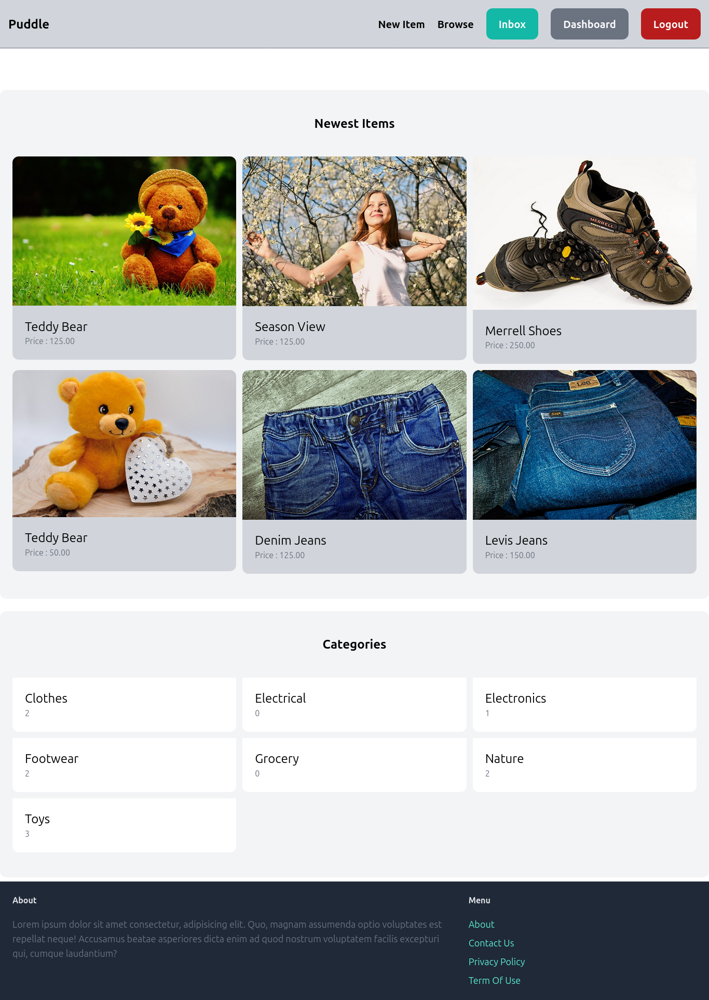
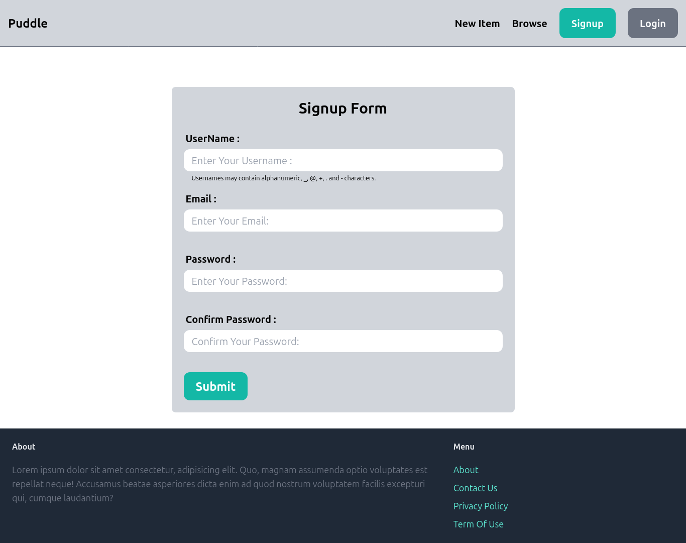
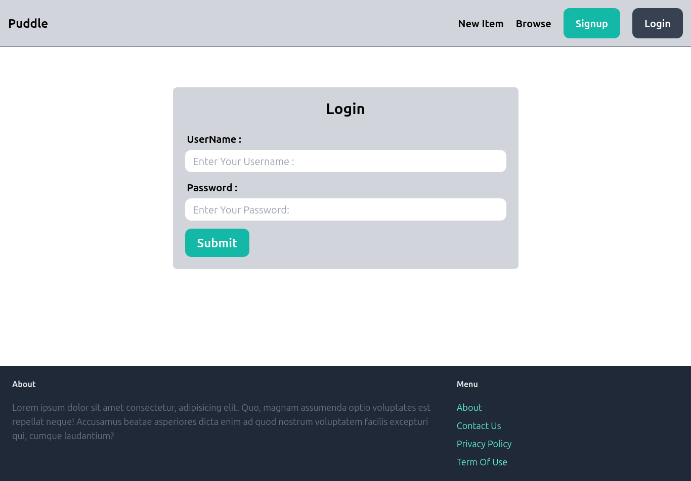
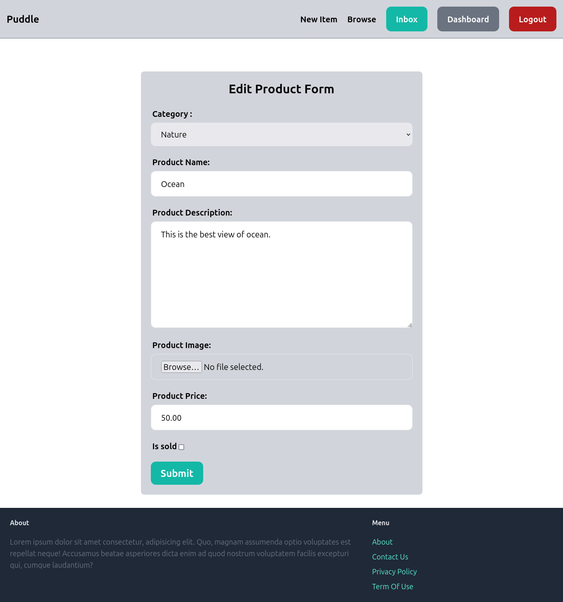
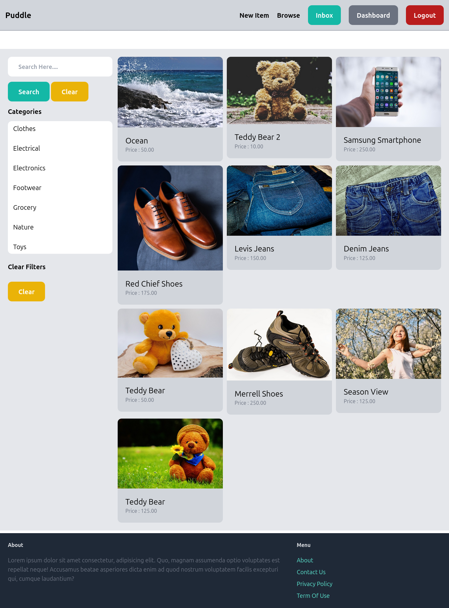
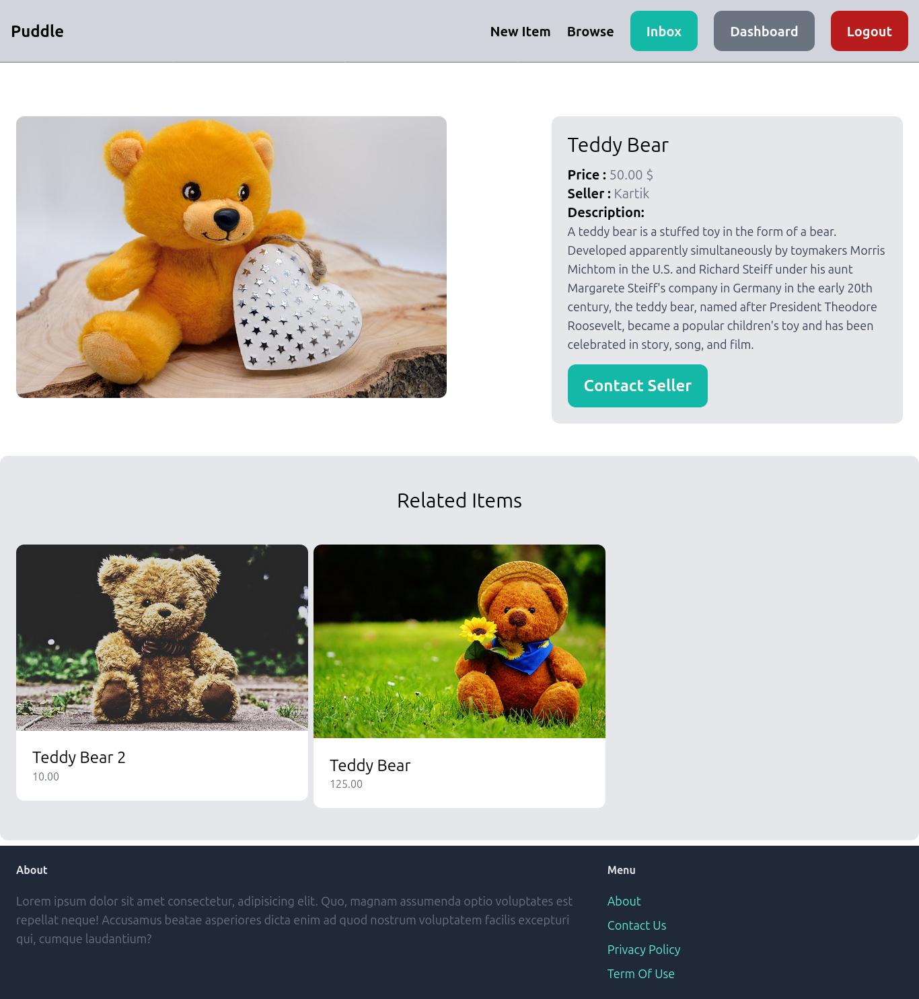

# Puddle Project

Puddle is a web application designed for managing and interacting with products. It includes features such as user authentication, product management, a dashboard, a browsing page, inbox communication, and contacting sellers. The project is built using **Django** and styled with **Tailwind CSS**.

---


## Features

### 1. Authentication
- **Signup:** Create User functionality.



- **Login:** Secure user login functionality.



- **Logout:** Session-based logout for users.


### 2. Product Management
- **Add Product:** Users can add new products with detailed information.


- **Edit Product:** Modify existing product details.


- **Delete Product:** Remove products no longer needed.


### 3. Dashboard
- A personalized dashboard for managing products, messages, and activities.


### 4. Browse
- Explore listed products easily via a user-friendly interface.



### 5. Inbox
- **Contact Seller:** Direct messaging feature to communicate with sellers.


---

## Technologies Used

- **Backend:** [Django](https://www.djangoproject.com/)
- **Frontend:** [Tailwind CSS](https://tailwindcss.com/)
- **Database:** SQLite (default) / PostgreSQL (optional)

---

## Installation

1. Clone the repository:
   ```bash
   git clone https://github.com/yourusername/puddle.git
   cd puddle
